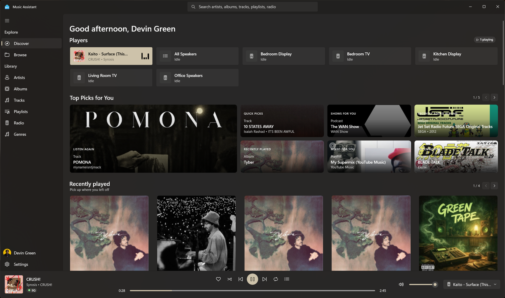

<p align="center">
    
</p>

<h1 align="center">
    Music Assistant for Windows
</h1>

<p align="center">
    A native Windows app for <a href="https://www.music-assistant.io/">Music Assistant</a>.
</p>

<p align="center">
    
</p>

## What it is

Music Assistant is a music server. It pulls your music together from services like Spotify, YouTube Music and your own files, and plays it on your speakers.

This app is a desktop client for it: a real Windows program, not a web page in a window. You point it at your Music Assistant server, sign in, and browse and play your music. You can also turn this PC into one of the speakers, control playback from the Windows media keys and the tray, and reach your server from anywhere when you set up remote access.


## Why
I hate web apps. Native feels better and uses less ram. Also <a href="https://havn.blog/2024/03/21/why-i-dont.html">this</a> article sums up my views on it

## Install

You need a Music Assistant server already running on your network. If you don't have one, set it up first: https://www.music-assistant.io/

1. Go to the [Releases](../../releases) page and download two files: `MusicAssistant_1.0.0.0_x64.msix` and `MusicAssistant-TestSigning.cer`.

2. Windows only installs apps it trusts, and this one is signed with a test certificate, so you tell Windows to trust it once. Open PowerShell **as Administrator** and run:

   ```powershell
   Import-Certificate -FilePath .\MusicAssistant-TestSigning.cer -CertStoreLocation Cert:\LocalMachine\TrustedPeople
   ```

3. Double-click `MusicAssistant_1.0.0.0_x64.msix` and click **Install**.

4. Open the app, enter your server address (for example `http://192.168.1.10:8095`), and sign in.

That's it. Later versions install over the top; you only do the certificate step once.

> Nothing extra to install. The app is self-contained, so you don't need .NET or any other runtime.

## Build

For anyone who wants to build it themselves.

You need [Visual Studio 2022](https://visualstudio.microsoft.com/) with the **.NET desktop development** and **Windows App SDK** workloads (or the [.NET 9 SDK](https://dotnet.microsoft.com/download/dotnet/9.0) plus the Windows 10 SDK on their own).

Run and test:

```powershell
cd MusicAssistant
dotnet build -c Release -p:Platform=x64 -r win-x64
.\bin\x64\Release\net9.0-windows10.0.26100.0\win-x64\MusicAssistant.exe
```

Build the installable package:

```powershell
cd MusicAssistant
dotnet build -c Release -p:Platform=x64 -r win-x64 -p:WindowsPackageType=MSIX -p:AppxPackageSigningEnabled=true -p:PackageCertificateThumbprint=<thumbprint>
```

The `.msix` lands in `dist\`.
